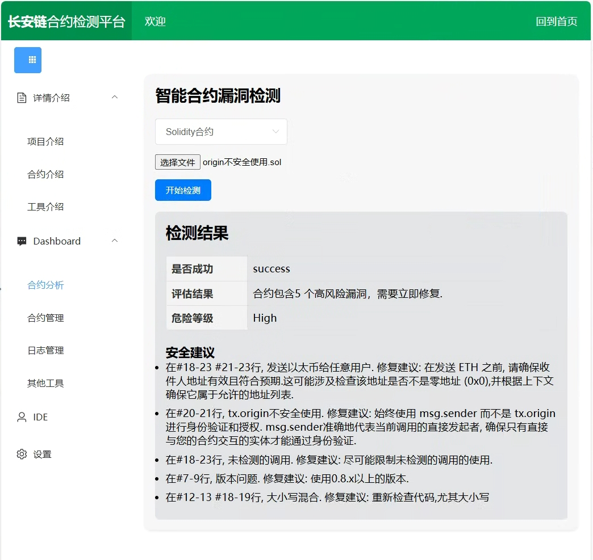

# Smart Contract Audit Platform for Diverse Programming Languages

<p>
 
</p>

> **Empowering Secure Smart Contract Development on ChainMaker**  
>
> This project provides a comprehensive suite of auditing and analysis tools specifically designed for smart contracts deployed on the [ChainMaker](https://chainmaker.org.cn) blockchain. Our platform supports diverse programming languages, facilitating thorough and robust auditing processes to enhance smart contract security, reliability, and efficiency.
> 
> **Key Features:**
>
> - 🔍 **In-depth Static Analysis:** Identify vulnerabilities and potential risks efficiently before deployment.
> - 🛠️ **Multi-language Support:** Seamless integration with various smart contract languages, enabling flexible audits and analysis.
> - 📊 **Comprehensive Reports:** Generate detailed and actionable reports to simplify debugging and improve code quality.
> - ⚙️ **Extensible Architecture:** Easily add custom analysis rules and plugins tailored to specific project requirements.

===========================================
## How to install on your server

* You can download the zip or clone the project with git.

    `https://github.com/bit-smartcontract-analysis/changan-SC-platform.git`

* Install `equirements.txt` via terminal: 

    `pip install -r /path/to/requirements.txt`

* Install MySQL：

    mYSQL is available at [link](https://dev.mysql.com/downloads/mysql/).


### Quick start

* To enable all development features (including debug mode) you can export the FLASK_ENV environment variable and set it to development before running the server:

    `export FLASK_ENV=development`

* To run the application you can use the **flask** command or python’s -m switch with Flask. Before you can do that you need to tell your terminal the application to work with by exporting the **FLASK_APP** environment variable:

    `export FLASK_APP=app.py`

* To test the web app, execute

    ``` Shell
    $ flask run
        * Running on http://127.0.0.1:5000/
    ```

* Alternatively you can use python -m flask:
    ``` Shell
    $ python -m flask run
        * Running on http://127.0.0.1:5000/
    ```
### How to use

* 如果是第一次使用，请在MySQL建立相应的database，并安装config.py进行配置（你也可以根据你的需要修改配置）

* 删除文件migrations，并建立自己的db数据库通过一下指令：
    ``` Shell
   $ flask db init
   $ flask db migrate
   $ flask db upgrade
    ```

* 如果你想快速得到一些示例，可以运行以下指令
    ``` Shell
    $ Flask init_boards (init_roles, bind_roles, create_test_posts)
    ```

* 在注册用户的时候，由于本项目使用了celery机制异步发送，需要开启celery通过(注意，不同的系统celery安装方法不同，下面仅介绍windows)
    ``` Shell
    $ celery -A app.mycelery worker --loglevel=info -P gevent
    ```

* 在第一次使用的时，可以通过flask指令初始化一些配置,例如添加测试用户，添加测试post
    ``` Shell
    $ flask create_test_users 
    $ flask create_test_posts
    ``` 
 
### 脚本指令
  如果非开发人员，可以直接使用脚本指令，前提需要保证您的系统是windows，同时安装python3.8
* 配置环境
  ```
  点击install_app.bat
  ```
* 运行程序
  ```
  点击run_app.bat, 以及run_celery_mail.bat
  ```

### Requirements

* Python 3.8+
* Flask

==========================================

<p style="text-align: center;">
  
</p>

===========================================
## Docker container for Development and Production

All dependencies are installed to the docker container, there is no need to manually configure python3, mysql, redis, etc.

**Note: Only Ubuntu 20.04+ tested**

* Install docker

Start server backend:

```
./script/install-docker-ubuntu.sh
```
* Development

All changes for files in the source folder will take effect via docker volume. 

```
./script/start-sc-platform-docker-container-platform.sh
```

Now static page worked at http://localhost:5000/cms#/scAnalyze and also work for local network.

Then start server frontend optionally, if you want to debug frontend project at the same time, in [changan-SC-vue](https://github.com/bit-smartcontract-analysis/changan-SC-vue) run:

```
npm run serve
```

Now vue dev server worked at http://localhost:8081/cms#/scAnalyze and also work for local network.


* Production 


All changes for files in the source folder will not take effect, must stop and start docker container to modify any file.

```
./script/start-sc-platform-docker-container-prod.sh
```

* Stop all 
Work both for Development and Production 

```
./script/stop-sc-platform-docker-container-all.sh
```

* Troubleshooting

** Dockerhub register cn mirror not working

Its better to config [dockerhub mirror](https://docs.docker.com/docker-hub/image-library/mirror/) with latest mirrors. For example:

```
  "registry-mirrors": [
    "https://docker.1panel.dev",
    "https://docker.anyhub.us.kg",
    "https://docker.m.daocloud.io",
    "https://dockerproxy.com",
    "https://docker.mirrors.ustc.edu.cn"
  ]
```

> **Contribute & Collaborate:**  
> Your feedback and contributions are highly appreciated! If you identify any errors, have suggestions, or wish to collaborate, please feel free to reach out to us via e-mail: [weizhiyuan@bit.edu.cn](mailto:weizhiyuan@bit.edu.cn).  
>
> If you find our survey useful for your research, please cite the following paper:

```bibtex
@article{10.1145/3695864,
author = {Wei, Zhiyuan and Sun, Jing and Zhang, Zijian and Zhang, Xianhao and Yang, Xiaoxuan and Zhu, Liehuang},
title = {Survey on Quality Assurance of Smart Contracts},
year = {2024},
publisher = {Association for Computing Machinery},
address = {New York, NY, USA},
issn = {0360-0300},
url = {https://doi.org/10.1145/3695864},
doi = {10.1145/3695864},
note = {Just Accepted},
journal = {ACM Comput. Surv.},
month = {sep},
keywords = {smart contract, security, vulnerabilities, attacks, defenses}
}

@article{wei2023comparative,
  title={A Comparative Evaluation of Automated Analysis Tools for Solidity Smart Contracts},
  author={Wei, Zhiyuan and Sun, Jing and Zhang, Zijian and Zhang, Xianhao and Li, Meng and Zhu, Liehuang},
  journal={arXiv preprint arXiv:2310.20212},
  year={2023}
}
```
