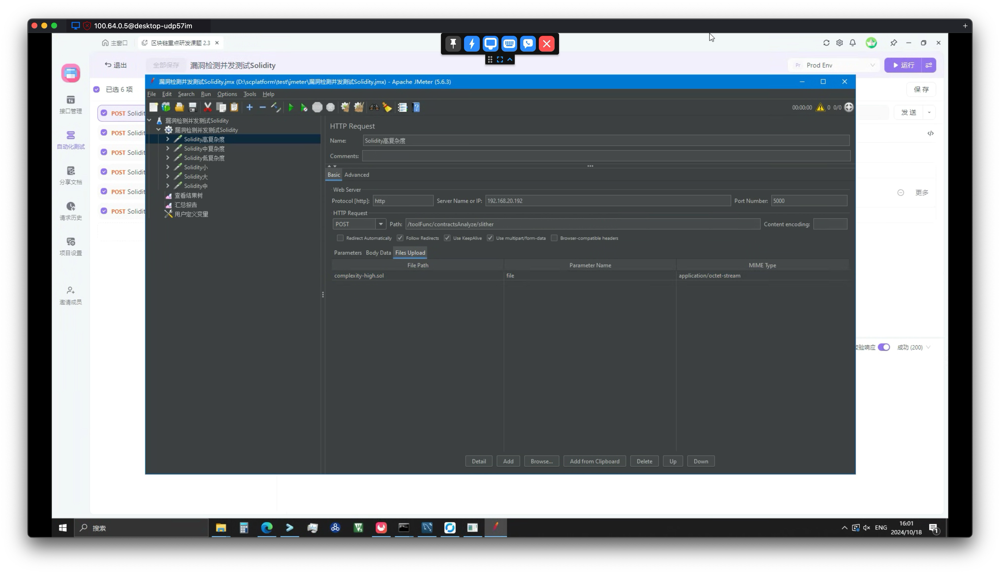

# ，Apifox 和 JMeter 性能测试用例构造指南

首先使用 apifox 构造请求接口，并自测：

创建自动化测试：

添加步骤从接口导入，增加自动同步

运行测试自测保证请求正确：

导出 jmeter 格式，prod 环境

放到项目的 test 目录 的  jmeter 目录

开启 jmeter 

file open 打开 jmx 文件

delete 这个 parameter

点击 add 按照这个表单填写，注意

*  file 不要绝对路径， 只需要文件和 jmx 一个目录即可，
* browser 不要点无效
* 注意 parameter name 有的业务是 file 有的 是 files， 要和业务接口保持一致

ctrl+s 保存，并点击绿色播放按钮自测

查看结果树，测试通过

